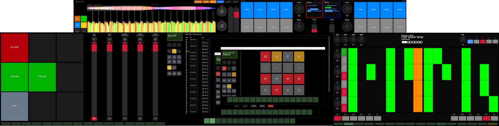

Regroove Meister
================

MIDI Controller Suite for Live/DJ Performance

This tool has mostly been created for my own use with Regroove and other applications for Live performance.
It uses WebMIDI to communicate with MIDI controllers and software. I have personally tested it on Android,
like a Samsung Tab, connected to a PC running Regroove, Mixxx, iPads with Korg Gadget/Module and some
physical devices, like a Volca FM, etc.

While this works for me... it might not for you.

### Supported platforms

The following platforms have been tested

   - Linux (Fedora, Bazzite)
   - Windows 11
     - loopMidi
   - Android 12+

### Supported applications

   - Regroove and related apps
     - Samplecrate
     - Rescratch
     - Medness
   - Mixxx
   - Bitwig

### Support devices

The following controllers have been tested or integrated into the application

   - Korg nanoKontrol2
   - Korg nanoPAD2
   - Korg nanoKEY2
   - Korg KaossDJ
   - Novation Launchpad Mini
   - Novation Launchkey Mini MK2
   - Akai Fire
   - CME H4MIDI WC
   - ...

### Supported browsers

The following browsers are tested and supported

   - Vivaldi
   - Chrome
   - Firefox
   - Android Vivaldi
